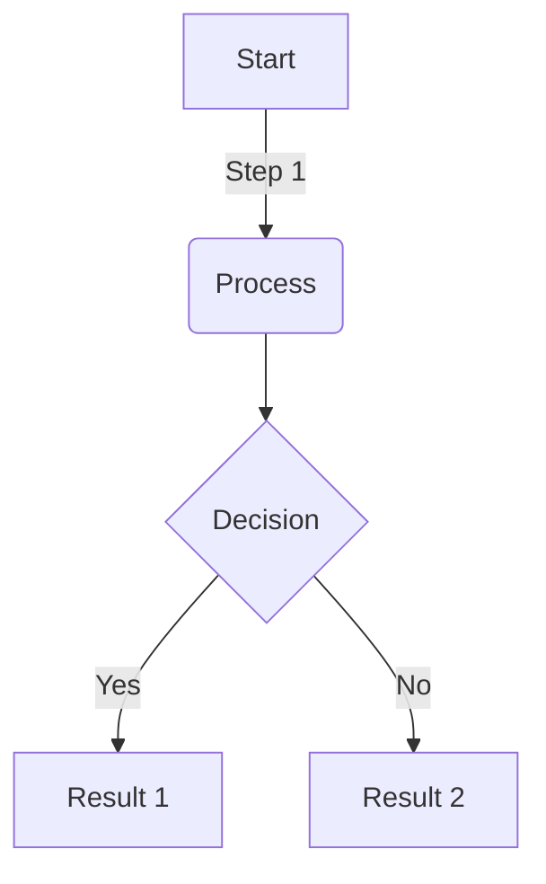
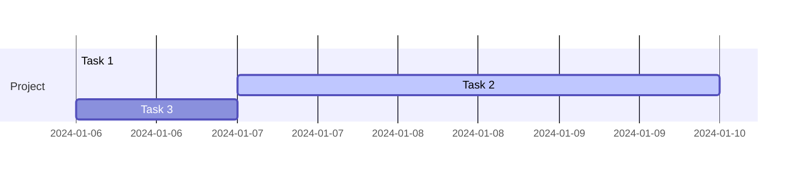

# HPC-ODA.org Website

The official website for the Energy Efficient HPC Working Group's Operational Data Analytics Community (HPC ODA).

## About

The HPC-ODA website serves as the central hub for the Operational Data Analytics Community, bringing together system administrators, researchers, data scientists, and HPC professionals who share a common goal: transforming how we understand, monitor, and optimize high-performance computing environments.

**Live Site**: [https://hpc-oda.org](https://hpc-oda.org)  
**Staging Site**: [https://develop.hpc-oda.pages.dev](https://develop.hpc-oda.pages.dev)

## Prerequisites

- [Go](https://golang.org/dl/) version 1.19 or later (for Hugo modules)
- Git
- A text editor or IDE

Note: Hugo is included via the `hugo.sh` proxy script, so you don't need to install it separately.

## Quick Start

1. **Clone the repository**
   ```bash
   git clone https://github.com/fahol/hpc-oda.git
   cd hpc-oda
   ```

2. **Download Hugo modules**
   ```bash
   ./hugo.sh mod download
   ```

3. **Run the development server**
   ```bash
   ./hugo.sh server -D
   ```

   Your site will be available at `http://localhost:1313/`

## Project Structure

```
hpc-oda/
├── assets/media/        # Images and media files
├── config/_default/     # Site configuration files
├── content/            # All content pages (markdown)
│   ├── authors/        # Author profiles
│   ├── blog/          # Blog posts
│   ├── brownbag/      # Brownbag presentations
│   ├── events/        # Event pages
│   ├── meetings/      # Meeting notes
│   ├── news/          # News updates
│   └── publications/  # Research publications
├── hugo-blox/         # Custom theme components
├── layouts/           # Custom layouts and partials
└── hugo.sh           # Hugo proxy script
```

## Contributing Content

### Adding Meeting Minutes

Create a new file directly in `content/meetings/` with the meeting date:
```bash
touch content/meetings/yyyy-mm-dd.md
```

Use this format:
```yaml
---
title: Month DD, YYYY Minutes
date: YYYY-MM-DD
draft: false
summary: Meeting minutes - Month DD, YYYY
authors:
- natalie-bates  # or your author ID
tags:
- Minutes
links:
- name: Team Drive
  url: https://drive.google.com/drive/folders/...
---

Meeting content in paragraph format...
```

### Adding a News Post

```bash
./hugo.sh new content/news/yyyy-mm-dd-title/index.md
```

Edit with this format:
```yaml
---
title: "Your News Title"
date: YYYY-MM-DDTHH:MM:SS-04:00
draft: false
authors:
- author-id-1
- author-id-2
featured: true
tags: []  # Add relevant tags
---

Opening paragraph introducing the news...

Additional paragraphs with details...
```

### Adding an Event

```bash
./hugo.sh new content/events/yyyy-event-name/index.md
```

Use this comprehensive format:
```yaml
---
title: Event Title
event: Full Event Name and Type (e.g., SC24 - Birds of a Feather)
event_url: https://event-website.com

location: Venue Name
address:
  street: Street Address
  city: City
  region: State/Region
  postcode: 'ZIP'
  country: Country

summary: Brief one-line summary
abstract: |-
  Multi-line detailed abstract
  describing the event...

# Event times (use UTC/Z format)
date: 'YYYY-MM-DDTHH:MM:SSZ'
date_end: 'YYYY-MM-DDTHH:MM:SSZ'
all_day: false

# When to publish on site
publishDate: 'YYYY-MM-DDTHH:MM:SSZ'

authors:
  - admin

tags:
  - Birds of a Feather
  - SC24

featured: false

image:
  caption: ''
  focal_point: Right

# Optional links
#links:
#  - name: Link Name
#    url: https://...

url_code: ''
url_pdf: ''
url_slides: ''
url_video: ''
profile: false
---
```

### Adding a Brownbag Presentation

```bash
./hugo.sh new content/brownbag/yyyy-mm-dd-presenter-topic/index.md
```

Format:
```yaml
---
title: Presentation Title

summary: One-line summary of the presentation
abstract: |-
  Detailed abstract describing
  the presentation content...

# Presentation times
date: 'YYYY-MM-DDTHH:MM:SSZ'
date_end: 'YYYY-MM-DDTHH:MM:SSZ'
all_day: false

publishDate: 'YYYY-MM-DDTHH:MM:SSZ'

authors:
  - presenter-author-id

tags:
  - Brownbag Presentations

featured: true

image:
  caption: ''
  focal_point: Right

links:
  - name: Transcript
    url: https://transcript-url

url_code: ''
url_pdf: ''
url_slides: 'https://slides-url'
url_video: 'https://video-url'

projects: []
---

## Discussion

Key discussion points and Q&A from the presentation...
```

### Adding a Blog Post

```bash
./hugo.sh new content/blog/your-post-title/index.md
```

Format:
```yaml
---
title: Blog Post Title
summary: Brief summary of the post
date: YYYY-MM-DD

# Featured image
image:
  caption: 'Image credit: [**Source**](https://source-url)'

authors:
  - admin
  - coauthor-id

tags:
  - Tag1
  - Tag2
  - Tag3
---

Welcome/Introduction paragraph...



## Section 1

Content...

## Section 2

Content...
```

### Adding a Publication

```bash
./hugo.sh new content/publications/author-keyword-year/index.md
```

Create with this structure:
```yaml
---
title: "Full Paper Title"
authors:
- Author One
- Author Two
- author-id  # Use existing author ID if available
date: "YYYY-MM-DDT00:00:00Z"
doi: "10.1234/doi-number"

# Schedule page publish date (NOT publication's date)
publishDate: "YYYY-MM-DDT00:00:00Z"

# Publication type (see options in Hugo docs)
publication_types: ["1"]  # Conference paper

# Publication name and optional abbreviated publication name
publication: "In *Conference Name*"
publication_short: "In *CONF*"

abstract: Full abstract text...

# Summary (optional)
summary: One-line summary.

tags:
- High Performance Computing
- Operational Data Analytics
featured: true

links:
- name: Conference Site
  url: https://conference-url
url_pdf: https://pdf-url
url_code: ''
url_dataset: ''
url_poster: ''
url_project: ''
url_slides: ''
url_source: ''
url_video: ''

# Featured image
image:
  caption: 'Image credit: [**Source**](https://source)'
  focal_point: ""
  preview_only: false

# Associated Projects (optional)
projects: []

# Slides (optional)
slides: ""
---
```

Also create a `cite.bib` file in the same directory with the BibTeX citation.

### Adding an Author Profile

```bash
cp -r content/authors/template content/authors/your-name
```

Edit `content/authors/your-name/_index.md`:
```yaml
---
title: Your Full Name
role: Your Role/Title
organizations:
- name: Organization Name
  url: "https://org-website"

bio: One-line bio.

interests:
- Interest 1
- Interest 2
- Interest 3

education:
  courses:
  - course: PhD in Field
    institution: University
    year: YYYY
  - course: MS in Field
    institution: University
    year: YYYY

social:
- icon: envelope
  icon_pack: fas
  link: 'mailto:email@example.com'
- icon: linkedin
  icon_pack: fab
  link: https://linkedin.com/in/username
- icon: github
  icon_pack: fab
  link: https://github.com/username

user_groups:
- Researchers
- Team Members
---

Brief biography paragraph...
```

Add your photo as `avatar.jpg` or `avatar.png` in the same directory.

## Adding Multi-Media Content

Hugo and HugoBlox provide extensive support for embedding rich media content. Most examples can be found in `./content/blog/` and `./content-examples/`.

### Images

#### Featured Images
Place a `featured.jpg` or `featured.png` in your page's folder:
```yaml
# In frontmatter
image:
  caption: 'Image credit: [**Unsplash**](https://unsplash.com)'
  focal_point: Right  # Options: Smart, Center, TopLeft, Top, TopRight, Left, Right, BottomLeft, Bottom, BottomRight
```

#### Inline Images
Store images in `assets/media/` and reference them:
```markdown

```

#### Icons
Use inline icons with the icon shortcode:
```markdown
 Python
 GitHub
```

### Videos

#### YouTube
```markdown

# Example:

```

#### Bilibili
```markdown

# Example:

```

#### Local Video Files
Place video files in `assets/media/` or your page folder:
```markdown

```

### Audio

Add podcasts or music by placing MP3 files in the page folder or media library:
```markdown

```

### Data Visualizations

#### Plotly Charts
1. Save your Plotly JSON in the page folder (e.g., `line-chart.json`)
2. Embed it using:
```markdown

```

Use the [Plotly JSON Editor](http://plotly-json-editor.getforge.io/) to create charts.

#### Mermaid Diagrams
Create flowcharts, sequence diagrams, class diagrams, state diagrams, and Gantt charts:

```markdown

```

```markdown

```

#### Mind Maps (Markmap)
Create mind maps with optional height setting:
```markdown
```markmap {height="200px"}
- Main Topic
  - Subtopic 1
    - Detail A
    - Detail B
  - Subtopic 2
    - Detail C
    - Detail D
```
```

#### Data Tables
Display CSV files as formatted tables:
```markdown

```

### Mathematical Content

Enable math in `config/_default/params.yaml`, then use:

#### Inline Math
```markdown
$\nabla F(\mathbf{x}_{n})$
```

#### Block Math
```markdown

$$
\gamma_{n} = \frac{ \left | \left (\mathbf x_{n} - \mathbf x_{n-1} \right )^T \left [\nabla F (\mathbf x_{n}) - \nabla F (\mathbf x_{n-1}) \right ] \right |}{\left \|\nabla F(\mathbf{x}_{n}) - \nabla F(\mathbf{x}_{n-1}) \right \|^2}
$$

```

### Code & Syntax Highlighting

Standard markdown code blocks with language specification:
```markdown
```python
import pandas as pd
data = pd.read_csv("data.csv")
data.head()
```
```

Configure code theme in `config/_default/params.yaml`.

### Interactive Elements

#### Spoilers/Reveals
Hide content until clicked:
```markdown

Hidden content here!

```

#### Table of Contents
Add an interactive table of contents:
```markdown

```

### Text Formatting

#### Callouts/Alerts
Draw attention to important information:
```markdown
{}
This is an informational note.
{}

{}
This is a warning message.
{}
```

#### Highlighting
```markdown
<mark>Highlighted text</mark>
```

#### Todo Lists
```markdown
- [x] Completed task
  - [x] Completed subtask
- [ ] Pending task
```

### External Content

In your page's frontmatter, link to external resources:
```yaml
# Links to external content
url_pdf: 'path/to/document.pdf'
url_slides: 'https://slides.com/presentation'
url_video: 'https://video-platform.com/video'
url_code: 'https://github.com/repo'
url_dataset: 'https://data-repository.com'
url_poster: 'path/to/poster.pdf'
url_source: 'https://source-link.com'

# Custom links
links:
  - name: Custom Link
    url: https://example.com
  - name: Another Link
    url: https://another-example.com
```

## Configuration

Key configuration files are in `config/_default/`:

- `hugo.yaml` - Main Hugo configuration
- `params.yaml` - Site parameters (appearance, SEO, etc.)
- `menus.yaml` - Navigation menu structure
- `module.yaml` - Hugo module configuration

## Building for Production

```bash
./hugo.sh --gc --minify
```

The built site will be in the `public/` directory.

## Deployment

The site is automatically deployed via Cloudflare Pages:

- **Production**: Push to `main` branch → deploys to [https://hpc-oda.org](https://hpc-oda.org)
- **Staging**: Push to `develop` branch → deploys to [https://develop.hpc-oda.pages.dev](https://develop.hpc-oda.pages.dev)

### Manual Deployment

If you need to deploy manually:

1. Build the site:
   ```bash
   ./hugo.sh version && rm -rf public/* && hugo --cleanDestinationDir
   ```

2. The `public/` directory contains the static site ready for deployment

## Development Guidelines

1. **Branch Strategy**
   - Work on feature branches
   - Create pull requests to `develop` branch
   - After testing on staging, merge `develop` to `main`

2. **Content Guidelines**
   - Use meaningful file names (e.g., `2025-01-15-announcement-title`)
   - Include featured images when possible (place in same directory as `index.md`)
   - Add appropriate tags and categories
   - Credit authors properly

3. **Image Guidelines**
   - Place images in `assets/media/` for site-wide assets
   - Place images in content directories for page-specific images
   - Use descriptive filenames
   - Optimize images for web (Hugo will process them automatically)

## Troubleshooting

### Module errors
```bash
./hugo.sh mod clean
./hugo.sh mod download
```

### Build errors
Check Hugo version:
```bash
./hugo.sh version
```

### Content not appearing
- Check if content has `draft: true` in frontmatter
- Ensure proper date format (YYYY-MM-DD)
- Verify file is in correct directory structure

## Resources

- [Hugo Documentation](https://gohugo.io/documentation/)
- [HugoBlox Documentation](https://docs.hugoblox.com/)
- [HugoBlox Theme](https://github.com/HugoBlox/theme-landing-page)
- [Markdown Guide](https://www.markdownguide.org/)
- [Embedding videos and gifs](https://www.dbbrunson.com/docs/effective-online-presence/markdown-extensions-capabilities/embedding-videos-gifs/)

## Community

Join the HPC ODA community:
- Monthly virtual meetings
- Brownbag presentation series
- Events at major HPC conferences

Contact:
- **Michael Ott** (Leibniz Supercomputing Center)
- **Natalie Bates** (EE HPC WG)

## License

This project is licensed under the MIT License - see the [LICENSE.md](LICENSE.md) file for details.

